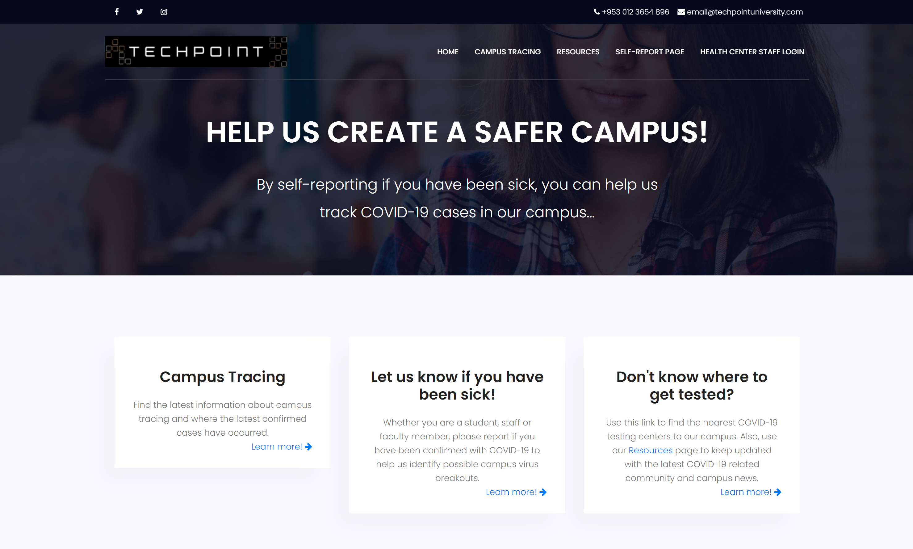

# TechPoint Tracer
### Part of the TechPoint S.O.S COVID Detection Challenge 2020.

	

	Due to the ongoing pandemic, universities and colleges need to facilitate the access of information regarding COVID-1 in their campus. They need a user interface that is easy to navigate so students, faculty and staff can be well informed and stay safe during such uncertain times. Our website, <b>TechPoint Tracer</b>, will do just that. Our seamless, intuitive graphical user will allow university members to log in their symptoms in relation to COVID-19 and building they went into. This information will be used to inform university members to see, in real-ime, places in campus they should avoid, get alerted if they may have been exposed during their daily activities around campus, and where to go to stay safe through our live, interactive campus cases map. Not only that, but students will also have access to useful COVID-19 resources such as city's testing centers near their location, university news and guidelines, and information to get through this pandemic and quarantine. 

## Features
Techpoint Tracer includes the follwing features: 
* Deployed through the university's health center to provide authentication.
* Ability for university members to self-report their symptoms, previous exposure to CCOVID-19, and campus buildings they have visitd within the last two weeks.
* Ability for the university's health center administrators to handle, trace and confirm information collected by university members. 
* A live, interactive map with the cases reported on campus with the date it was reported.
* Abiliy for the university's health center administrators to send email alerts to inform a new cases has been confirmed so the necessary precautions can be taken by university members.
* Resoures page for students (and the community in general) including but not limited to: 
	* Near testing centers
	* Reopening guidelines
	* What to do if sick

## Technical Specifications
### Web Application Architecture

	 
	Figure 1. TechPoint Tracer Architeture

<b>Techpoint Tracer's Three-Tier Architecture:</b> 
* <b>Client:</b> University members interacting through TechPoint Tracer's user interface.
* <b>Server:</b> TechPoint Tracer's web application server is mostly PHP with some JavaScript. The server is also responsible to interact with the external entities of our web application shown above.
* <b>Database:</b> TechPoint Tracer utilizes ClearDB-MySQL database.
* <b><ins>TechPoint tracer and all of its external entities are integrated and deployed through Heroku.</ins></b>

<b>Installation and Dependencies:</b> 
TechPoint tracer has no additional installation requirements or dependencies. 

### Deployment

<a href="https://covid-detection-team09.herokuapp.com/">TechPoint Tracer Website </a> 
To learn more about TechPoint Tracer, please visit the DevPost website: 
 <a href="https://devpost.com/software/covid-detection-7fk3ur">TechPoint Tracer By: Outbreak Detection Team 09</a> 
