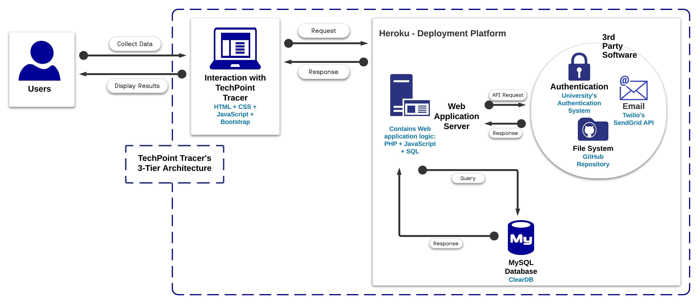

# TechPoint Tracer
### Part of the TechPoint S.O.S COVID Detection Challenge 2020.

	

	Due to the ongoing pandemic, universities and colleges need to facilitate the access of information regarding COVID-1 in their campus. They need a user interface that is easy to navigate so students, faculty and staff can be well informed and stay safe during such uncertain times. Our website, <b>TechPoint Tracer</b>, will do just that. Our seamless, intuitive graphical user will allow university members to log in their symptoms in relation to COVID-19 and building they went into. This information will be used to inform university members to see, in real-ime, places in campus they should avoid, get alerted if they may have been exposed during their daily activities around campus, and where to go to stay safe through our live, interactive campus cases map. Not only that, but students will also have access to useful COVID-19 resources such as city's testing centers near their location, university news and guidelines, and information to get through this pandemic and quarantine. 

## Features
Techpoint Tracer includes the follwing features: 
* Deployed through the university's health center to provide authentication.
* Ability for university members to self-report their symptoms, previous exposure to CCOVID-19, and campus buildings they have visitd within the last two weeks.
* Ability for the university's health center administrators to handle, trace and confirm information collected by university members. 
* A live, interactive map with the cases reported on campus with the date it was reported.
* Abiliy for the university's health center administrators to send email alerts to inform a new cases has been confirmed so the necessary precautions can be taken by university members.
* Resoures page for students (and the community in general) including but not limited to: 
	* Near testing centers
	* Reopening guidelines
	* What to do if sick

## Technical Specifications
### Web Application Architecture

	 
	Figure 1. TechPoint Tracer Architeture

<b>Techpoint Tracer's Three-Tier Architecture:</b> 
* <b>Client:</b> University members interacting through TechPoint Tracer's user interface.
* <b>Server:</b> TechPoint Tracer's web application server is mostly PHP with some JavaScript. The server is also responsible to interact with the external entities of our web application shown above.
* <b>Database:</b> TechPoint Tracer utilizes ClearDB-MySQL database.
* <b><ins>TechPoint tracer and all of its external entities are integrated and deployed through Heroku.</ins></b>

### Installation and Dependencies: 
TechPoint tracer has no additional installation requirements or dependencies. 

### Tools, Libraries and Frameworks
* <a href="https://github.com/sendgrid/sendgrid-php" target="_blank">Twilio’s SendGrid PHP API Library</a> used along with the <a href="https://github.com/PHPMailer/PHPMailer" target="_blank"> PHPMailer Library</a> in our project will allow the health center administrator to send email alerts to inform university members when a new case is confirmed and the location of the case. We chose them because they are free, third-party open-source libraries we could easily integrate into our system through Heroku. 
* Python’s library <a href="https://pypi.org/project/Faker/" target="_blank"> Faker </a> was used to populate the database tables with data used for testing the web application. We decided to use this library to save us the work of populating the database manually and used the Python version of it because it required a more straightforward set up than the PHP version.
* Our web application is deployed in <b>Heroku</b>. We chose this deployment platform because it allowed us to integrate all of our third-party software in one place. It also allowed us to integrate our GitHub repository to the application we created in Heroku to allow automatic deployments without the need to worry about dependencies.
* The server side of the application runs in PHP 7.2. It was chosen because it is a free, open-source language that has plenty of documentation online with a good framework base that helped us save time during the implementation of certain aspects of our website.
* We used the front-end framework Bootstrap to add animations and styling to our website. Using these ready-to-use interface components allowed us to save time during front-end design and enabled us to focus on back-end functionality.
* JavaScript was used to give our web application a more responsive and interactive user interface. From JavaScript, two significant JavaScript libraries were used, JQuery and AJAX, to send and receive information that was used in our web application.
* ClearDB MySQL was chosen as our open-source relational database because it was the database our team members were most familiar with and because it could be easily integrated into Heroku. The database is used to store the information collected from university members regarding COVID-19 through the website’s self-report questionnaire.

### Deployment

The live TechPoint Tracer Website can be visited <a href="https://covid-detection-team09.herokuapp.com/">here.</a> 
To learn more about TechPoint Tracer, please visit the DevPost page: 
 <a href="https://devpost.com/software/covid-detection-7fk3ur">TechPoint Tracer By: Outbreak Detection Team 09</a> 
